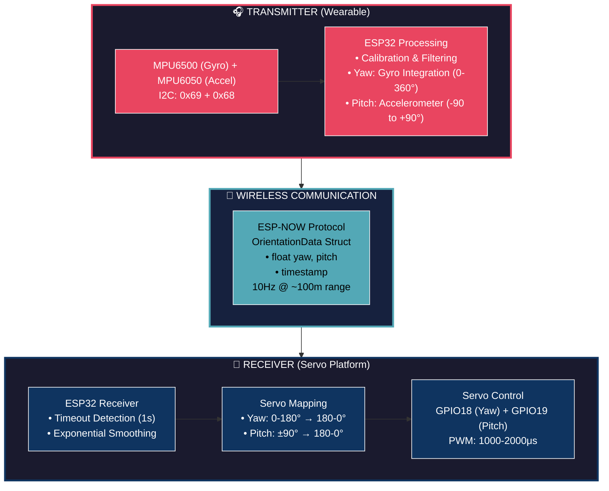
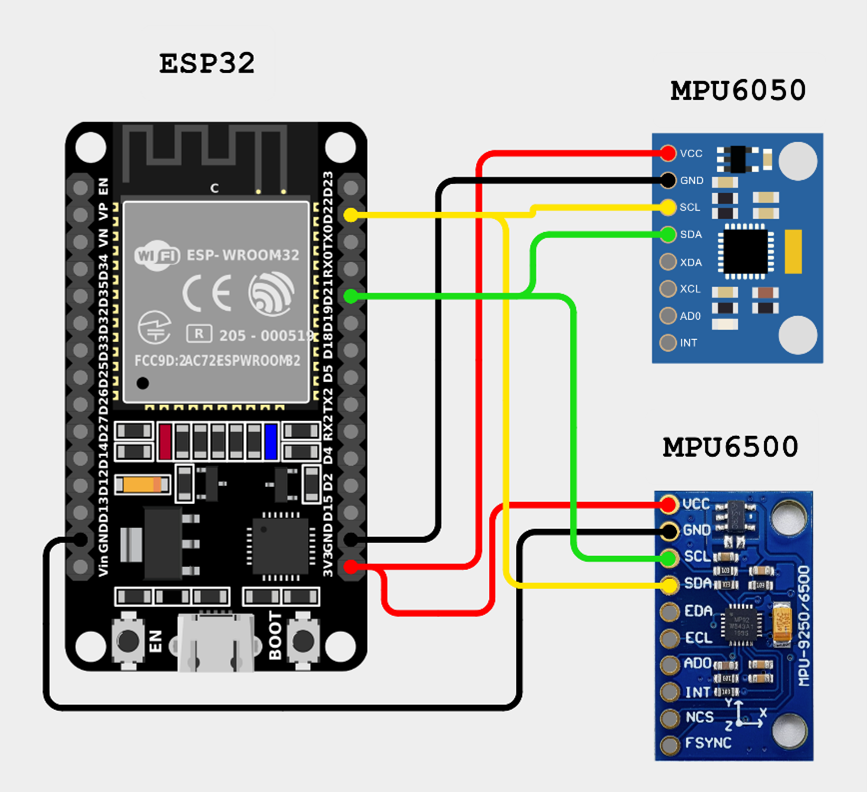
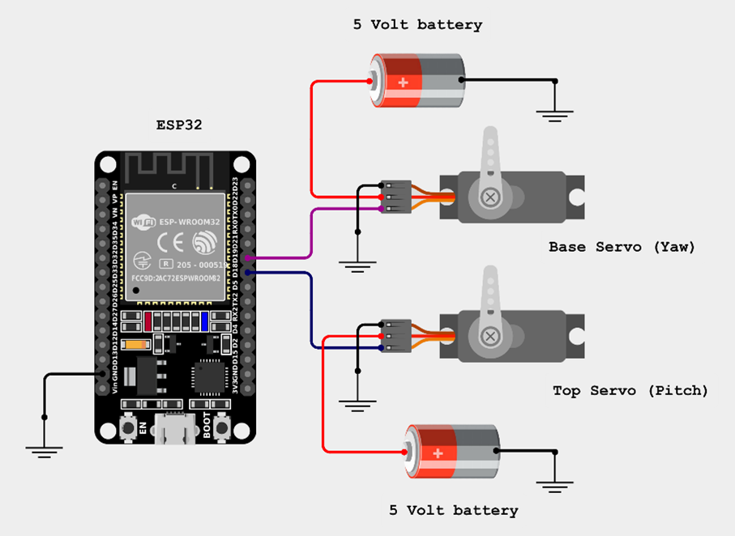

# Wireless Head Tracking System

A real-time wireless head tracking system using ESP32 microcontrollers that captures head orientation and replicates it mechanically using servos. This system uses dual IMU sensors for accurate 2-DOF rotational tracking (yaw and pitch) and ESP-NOW protocol for low-latency wireless communication.

## Table of Contents
- [Overview](#overview)
- [Features](#features)
- [Hardware Requirements](#hardware-requirements)
- [System Architecture](#system-architecture)
- [How It Works](#how-it-works)
- [Circuit Diagrams](#circuit-diagrams)
- [Installation & Setup](#installation--setup)
- [Calibration](#calibration)
- [Usage](#usage)
- [Troubleshooting](#troubleshooting)
- [Applications](#applications)
- [License](#license)

## Overview

This project implements a wireless head tracking system consisting of two main units:
- **Transmitter Unit**: A wearable device with dual IMU sensors that measures head orientation
- **Receiver Unit**: A servo-controlled mechanism that replicates the tracked head movements

The system provides real-time tracking with approximately 100ms latency at 10Hz update rate using the ESP-NOW protocol for reliable wireless communication.

## Features

- **Dual IMU Sensor Fusion**: Combines MPU6500 and MPU6050 sensors for accurate tracking
- **Yaw Tracking**: 360° continuous rotation tracking via gyroscope integration (servo output limited to 180°)
- **Pitch Tracking**: ±90° tilt detection using accelerometer data
- **Wireless Communication**: ESP-NOW protocol for low-latency data transmission
- **Gyroscope Calibration**: Automatic offset calibration at startup to minimize drift
- **Signal Filtering**: 5-sample moving average filter for smooth motion
- **Data Validation**: Built-in checks for unrealistic sensor readings
- **Manual Reset**: Serial command interface to reset yaw orientation
- **Servo Control**: Precise mechanical replication of head movements

## Hardware Requirements

### Transmitter Unit
- ESP32 Development Board
- MPU6500 (or MPU9250) - Gyroscope for yaw tracking
- MPU6050 - Accelerometer for pitch tracking
- Power source (battery recommended for wearable use)

### Receiver Unit
- ESP32 Development Board
- 2× Servo Motors (180° range)
  - Yaw servo (horizontal rotation)
  - Pitch servo (vertical tilt)
- Power supply suitable for servos (5V, adequate current)

### Additional
- I2C pull-up resistors (if not integrated on sensor modules)
- Connecting wires
- Mounting hardware/headset frame

## System Architecture

### Block Diagram



The system uses a master-slave architecture where the transmitter continuously broadcasts orientation data, and the receiver listens and actuates the servos accordingly.

## How It Works

### Transmitter Operation

1. **Sensor Initialization**
   - MPU6500 initialized at I2C address 0x69 (AD0 pin high)
   - MPU6050 initialized at I2C address 0x68 (AD0 pin low)
   - Both sensors share the I2C bus (SDA: GPIO21, SCL: GPIO22)

2. **Gyroscope Calibration**
   - Collects 500 samples while sensor is stationary
   - Calculates average offset for gyroscope Z-axis
   - Warns if offset exceeds ±10°/s (indicates unstable environment)

3. **Yaw Calculation (MPU6500)**
   - Reads gyroscope Z-axis angular velocity
   - Subtracts calibrated offset
   - Applies 5-sample moving average filter
   - Integrates over time: `yaw += gyroZ_filtered × deltaTime`
   - Normalizes to 0-360° range
   - Validates data (rejects readings > 1000°/s)

4. **Pitch Calculation (MPU6050)**
   - Reads 3-axis accelerometer data
   - Converts to g-forces (±2g range, 16384 LSB/g)
   - Calculates magnitude to validate data (0.5g - 1.5g expected)
   - Computes pitch: `pitch = atan2(ay, sqrt(ax² + az²)) × 180/π`

5. **Wireless Transmission**
   - Packages yaw and pitch into struct
   - Transmits via ESP-NOW to receiver MAC address
   - Updates at 10Hz (100ms interval)

### Receiver Operation

1. **ESP-NOW Reception**
   - Listens for incoming orientation data packets
   - Validates packet size matches OrientationData struct

2. **Servo Mapping**
   - **Yaw**: Maps 0-180° input to 180-0° servo (inverted for mechanical correction)
   - **Pitch**: Maps -90 to +90° input to 180-0° servo
   - Constrains values to prevent servo damage

3. **Servo Actuation**
   - Writes mapped values to servos (GPIO18 and GPIO19)
   - Servos configured with 1000-2000μs pulse width range

## Circuit Diagrams

### Transmitter Circuit


**Pin Connections:**
- MPU6500: SDA → GPIO21, SCL → GPIO22, AD0 → VCC (address 0x69)
- MPU6050: SDA → GPIO21, SCL → GPIO22, AD0 → GND (address 0x68)

### Receiver Circuit


**Pin Connections:**
- Yaw Servo Signal → GPIO18
- Pitch Servo Signal → GPIO19
- Servo Power: Connect to adequate 5V supply (not USB power)

## Installation & Setup

### 1. Arduino IDE Setup
```bash
# Install Arduino IDE and add ESP32 board support
# In Arduino IDE: File → Preferences → Additional Board Manager URLs
# Add: https://raw.githubusercontent.com/espressif/arduino-esp32/gh-pages/package_esp32_index.json
```

### 2. Install Required Libraries
- ESP32Servo
- MPU6050 (by Electronic Cats)
- MPU9250_asukiaaa

```bash
# In Arduino IDE: Tools → Manage Libraries
# Search and install each library
```

### 3. Configure Receiver MAC Address
Before uploading transmitter code:
1. Upload the receiver code first
2. Open Serial Monitor (115200 baud)
3. Note the displayed MAC address
4. Update the MAC address in [Transmitter/Transmitter.ino](Transmitter/Transmitter.ino) line 30:
```cpp
uint8_t receiverAddress[] = { 0xXX, 0xXX, 0xXX, 0xXX, 0xXX, 0xXX };
```

### 4. Upload Code
1. Upload `Receiver.ino` to receiver ESP32
2. Upload `Transmitter.ino` to transmitter ESP32

## Calibration

### Gyroscope Calibration
The transmitter automatically calibrates on startup:
1. Place the transmitter on a stable surface
2. Keep it completely stationary
3. Power on and wait for "Calibrating gyroscope..." message
4. Calibration completes after ~2 seconds
5. Check that offset is within ±10°/s

### Servo Centering
Servos automatically center at 90° during receiver initialization. Adjust mechanical mounting if needed to ensure proper range of motion.

## Usage

1. **Power On**
   - Power the receiver unit first
   - Power the transmitter unit (triggers auto-calibration)

2. **Verification**
   - Open Serial Monitor on receiver (115200 baud)
   - Verify data reception: "Received -> Yaw: X | Pitch: Y"
   - Check servo movement matches head orientation

3. **Reset Yaw**
   - Connect to transmitter via Serial Monitor
   - Send command: `reset`
   - Yaw resets to 0°

4. **Normal Operation**
   - Wear or mount transmitter on head
   - Servos will replicate yaw and pitch movements
   - Yaw: Transmitter tracks 0-360° continuously, servo replicates 0-180° mechanically
   - Pitch range: ±90°

## Troubleshooting

### Sensors Not Detected
- Check I2C wiring (SDA, SCL, VCC, GND)
- Verify I2C addresses (use I2C scanner sketch)
- Ensure AD0 pins are correctly connected (high for 0x69, low for 0x68)

### Gyroscope Drift
- Recalibrate in a more stable environment
- Check for vibrations or movement during calibration
- Verify gyro offset is within ±10°/s

### No Data Reception
- Verify receiver MAC address in transmitter code
- Check ESP-NOW initialization messages
- Ensure both devices are powered and within range (~100m line-of-sight)

### Erratic Servo Movement
- Check power supply (servos need adequate current)
- Verify servo connections to correct GPIO pins
- Ensure data validation isn't rejecting readings (check serial output)

### Invalid Data Warnings
- "Gyroscope data invalid": Excessive angular velocity detected, reduce movement speed
- "Accelerometer data invalid": Magnitude check failed, sensor may be loose or malfunctioning

## Applications

- **Camera Gimbals**: FPV systems, cinema rigs
- **Robotic Heads**: Interactive robots, animatronics
- **VR/AR Tracking**: Head-mounted display orientation
- **Remote Camera Control**: Surveillance, telepresence
- **Motion Capture**: Animation reference, biomechanics
- **Accessibility Devices**: Head-controlled interfaces
- **Gaming**: Immersive head-tracking peripherals

## License

This project is licensed under the terms included in the [LICENSE](LICENSE) file.